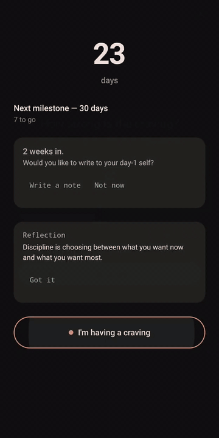
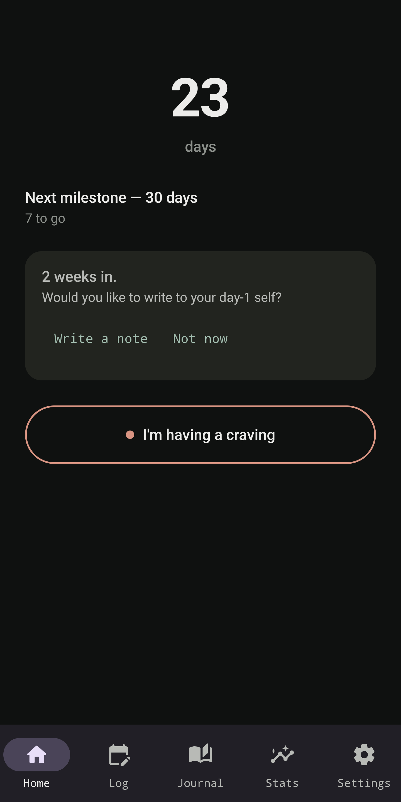
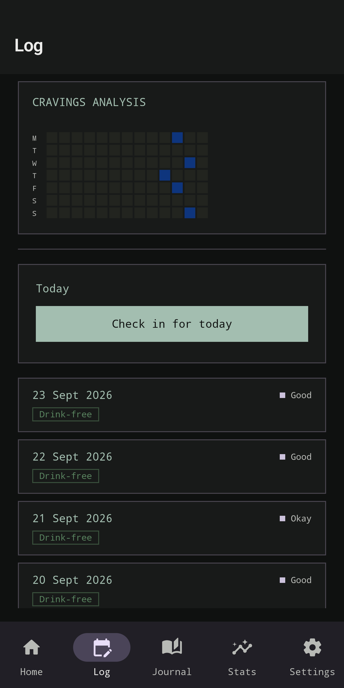
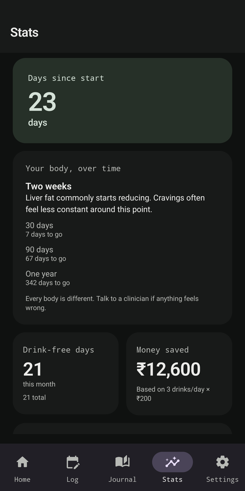

# Tidelet

<!-- Demo GIF placeholder: record from a running device/emulator and add to docs/media/demo.gif before launch (file does not exist yet) -->


Tidelet is an offline, local-only Android companion for urge surfing—helping you ride the wave of a craving until it passes, rather than fighting it.

## Screenshots

<!-- Screenshots need to be captured from a running device or emulator before launch -->
| Home | Ride the Wave | Box Breathing | Daily Log & Heatmap | Stats & Recovery |
| :---: | :---: | :---: | :---: | :---: |
|  |  |  |  |  |

## Features

### Craving SOS toolkit
- **Ride the Wave**: A 15-minute urge-surfing timer featuring an animated wave and selectable ambient soundscapes (Ocean, River, Rain, or Silent).
- **Breathe**: A 4-4-4-4 box-breathing exercise with cycle counting.
- **My Reasons**: A personal, editable list of motivations to reread in difficult moments.
- **Do Something Else**: A curated list of distraction activities with a random shuffle picker.
- **Thought Check**: A CBT-style thought-record tool for examining craving-related thoughts in the moment.
- **Journal**: Free-form writing during or after an urge.
- **Compassionate Reset**: Logs a slip ("I drank") without reset penalties, loss of past entries, or judgmental language.

### Tracking and reflection
- **Home**: Day counter tracking elapsed sobriety and progress toward the next milestone, with quick access to SOS tools.
- **Daily Log**: Daily check-in form and craving heatmap to observe patterns over time.
- **Weekly Reflection**: A guided end-of-week check-in.
- **Milestone Letters**: Write letters to your future self at milestones, unlocked to reread at later ones.
- **Journal History**: Read-only browsing of past Thought Checks (categorized by cognitive distortion), journal entries, and evening reviews.

### CBT and recovery tools
- **Cognitive Distortions Library**: Catalog of common thinking traps with practical antidotes for each.
- **Drink-Refusal Rehearsal**: Practice pre-written and custom refusal responses for social pressure.
- **Relapse-Prevention Plan**: Identify high-risk situations, early warning signs, and concrete coping plans.

### Stats and settings
- **Statistics**: Streak metrics and an evidence-based health and recovery timeline.
- **Drinking Baseline & Savings**: Calculate money saved based on a customizable baseline of typical drinks per day and beverage price, formatted in local currency.
- **Home-Screen Widget**: Displays your current sobriety streak directly on your home screen.
- **Data Export & Import**: Full on-device JSON data backup and restore, including a one-tap "verify my backup" self-check.
- **Community & Crisis Resources**: Direct dialer and browser links to crisis helplines and peer communities (Alcoholics Anonymous, SMART Recovery, Moderation Management, r/stopdrinking).
- **Getting Started Guide**: An in-app guide explaining the tools and how to apply them.

### What's next
- **Check-in Reminders**: Scheduled daily local notifications prompting a check-in.
- **Cut-Back / Moderation Mode**: A dedicated goal mode for users aiming to reduce alcohol consumption rather than quit entirely.

## Privacy

Tidelet has no backend server, no user accounts, no analytics or telemetry, and no ad SDKs. The app requests no network permissions in its Android manifest (`AndroidManifest.xml`), making it technically incapable of making a network call. All streak dates, check-ins, journal entries, and thought records remain strictly on your device in local storage. For complete details, see [PRIVACY.md](PRIVACY.md).

## Download

Pre-built APKs are available on the [GitHub Releases page](https://github.com/singhakshay-create/tidelet/releases/latest). GitHub's Releases feature isn't part of the repo's file tree, so it needs a full URL rather than a relative link.

Download the APK attached to the latest release and install it on an Android device running Android 8.0 (API 26) or higher.

## Build from source

Requirements: Android Studio (recent stable version), JDK 17, and Android SDK 35.

To clone the repository and compile the debug APK:

```bash
git clone https://github.com/singhakshay-create/tidelet.git
cd tidelet
./gradlew assembleDebug
```

The debug APK will be created at `app/build/outputs/apk/debug/app-debug.apk`. For project setup details, running tests, and development guidelines, see [CONTRIBUTING.md](CONTRIBUTING.md).

## Project structure

```
app/src/main/
├── AndroidManifest.xml        # Single activity and widget; requests zero network permissions
├── res/                       # UI layouts, strings, themes, and raw ambient audio recordings
└── java/com/tidelet/app/
    ├── TideletApplication.kt   # Manual dependency injection exposing TideletRepository
    ├── MainActivity.kt         # Entry activity hosting Compose navigation
    ├── data/
    │   ├── db/                # Room database, DAOs, and entities (CheckIn, CravingEvent, Reason, etc.)
    │   ├── prefs/             # DataStore Preferences for user settings and streak start date
    │   └── repo/              # TideletRepository managing data coordination
    ├── ui/
    │   ├── theme/             # Material 3 theme and extended color tokens
    │   ├── nav/               # Navigation routes and destinations
    │   ├── home/              # Day counter, milestone progress, companion cards
    │   ├── sos/               # SOS tools: Ride the Wave, Breathe, Reasons, Distractions, Thought Check
    │   ├── log/               # Daily check-in form and craving heatmap
    │   ├── journal/           # Journal entries, thought checks by distortion, evening reviews
    │   ├── stats/             # Streak statistics and health/recovery timeline
    │   ├── settings/          # Baseline settings, data export/import, backup verification
    │   ├── milestones/        # Milestone letters to future self
    │   ├── resources/         # Crisis lines and recovery community links
    │   └── weekly/            # Guided weekly reflection form
    └── widget/                # Home-screen streak widget provider and refresh worker
```

## Disclaimer

Tidelet is a self-help tool for managing cravings and tracking your own progress. It is not a medical device, it does not provide medical advice, diagnosis, or treatment, and it is not a substitute for professional care.

If you are struggling or in distress, please reach out to professional support:
- **US:** Call or text **988** (Suicide & Crisis Lifeline), or call the **SAMHSA National Helpline** at **1-800-662-4357** (free, confidential, 24/7).
- **Outside the US:** Please look up your local crisis line or emergency number (search for "[your country] crisis line" or "[your country] suicide prevention helpline").

If you are in immediate danger, contact your local emergency services.

## License

This program is free software licensed under the GNU General Public License v3.0 (GPL-3.0). See [LICENSE](LICENSE) for details.
